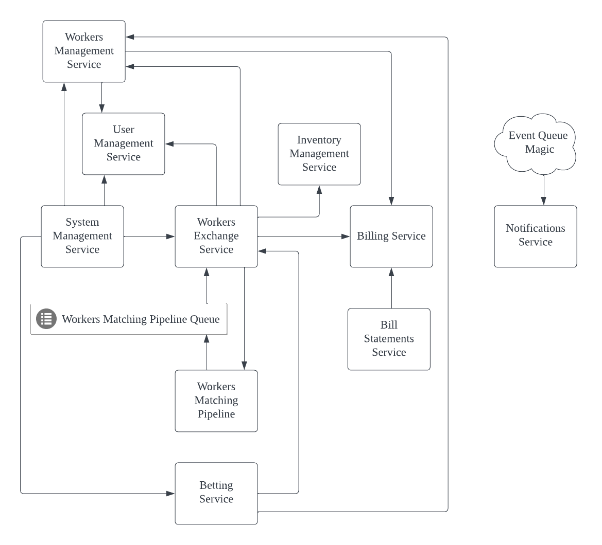

# Архитектура Системы, Неделя 0

## Сущности Предметной Области

1. **Клиент** (aka заказчик, "эталонный образец") - основной пользователь системы.
2. **Задача** (aka заявка, заказ) - поручение, составленное **клиентом**, требующее оплаты и исполнения.
3. **Администратор** (aka менеджер) - пользователь, занимающийся менеджментом системы и её пользователей.
4. **Исполнитель** (aka "обычный образец") - пользователь, отвечающий за исполнение переданых ему **задач**.
5. **Транзакция** (aka платёж, платёжка) - направленная финансовая операция, имеющая одного получателя и одного получителя и 
                                           означающая перемещение средств между пользователями системы или между системой и её пользователями.
6. **Платёжное поручение** (aka инвойс) - аггрегация **транзакций** пользователя системы за определённый период времени.                                           
7. **Расходник** - материальный компонент, необходимый для исполнения **заказа**.

## Сервисы

_Примечание 1_: в описаниях сервисов frontend-составляющая не выделяется как отдельный сервис/проект. 
                Он подразумевается как составляющая сервисов, которым необходим веб-интерфейс.

_Примечание 2_: направленные стрелки на диаграмме обозначают потоки обмена сообщениями. При наличии связи между сервисами A и Б
                отсутствие стрелки у сервиса А означает, что сервис Б не является инициатором сообщений к сервису А.
                
_Примечание 3_: предполагается, что при необходимости каждый сервис имеет своё хранилище данных, к которому не имеют доступ другие сервисы.
                На схеме хранилища данных не приводятся явно.

1. **Billing Service** (**BS**) - сервис, предоставляющий API для создания и одобрения транзакций в системе. Выступает как source-of-truth для финановых операций.
2. **Bill Statements Service** (**BSS**) - сервис менеджмента платёжных поручений. Отвечает за их периодическую генерацию, управление их статусом (оплатой).
3. **Inventory Management Service** (**IMS**) - сервис распределения расходников. Отвечает за создание поручений на исполнение задач, их передачу сторонним организациям. 
4. **Notifications Service** (**NS**) - сервис оповещений пользователей системы. Обрабатывает события в системе, полученные через очереди сообщений,
                                        и трансформирует их в оповещения для пользователей.
5. **System Management Service** (**SMS**) - сервис управления системой для администраторов. Реализует функции добавления новых пользователей, менеджмента исполнителей
                                             и их заявок, отмены заказов и т.д. путём кросс-коммуникации с другими сервисами.
6. **Workers Exchange Service** (**WES**) - сервис менеджмента задач. Позволяет создавать новые задачи, закрывать их, получать доступ к истории задач
                                            клиентов и исполнителей. Отвечает за кросс-коммуникацию с другими сервисами при создании задач.
7. **Workers Matching Pipeline** (**WMP**) - внешний процесс поиска подходящего исполнителя для задачи. Получает на вход все необходимые данные, асинхронно 
                                             передаёт результаты своей работы через очередь сообщений.
8. **Workers Management Service** (**WMS**) - сервис менеджмента исполнителей в системе. Отвечает за хранение информации об исполнителях, их активацию и деактивацию
                                              как активных исполнителей на бирже, выдачу штрафов и поощрений исполнителям, прохождение тестов на профпригодность.
9. **User Management Service** (**LMS**) - сервис менеджмента пользователелей в системе. Отвечает за создание/деактивацию пользователей, 
                                           менеджмент их прав доступа, предоставление доступа к системе, хранение основной информации о пользователях.
                                           
                                           

## Архитектурные Примечания

1. **BS** не позволяет удалять транзакции через API, только создавать специальные транзакции, отменяющие предыдущие операции.
2. **BSS** изолирован от **BS**, так как данные платёжные поручения выделены как отдельная доменная сущность.
   Впоследствие в **BSS** могут быть добавлены другие процессы генерации данных на основе платежей, которые при этом не будут
   влиять на работу **BS**.
3. Расчёт скидки происходит в процессе работы **WES**, **BS** получает только запрос на одобрение транзакции.
4. Для ускорения разработки, **WES** также берёт на себя хранение всей архивной информации, связанной с задачами. При необходимости,
   информацию о старых задачах можно вынести в отдельный сервис.
5. Для ускорения разработки, **WMS** также берёт на себя хранение всей информации, связанной с тестированием пользователей. При необходимости,
   менеджмент тестов исполнителей можно вынести в отдельный сервис.
6. **WES** включает в себя планировщик автоматической отмены задач по истечения срока исполнения. Он не выделен как отдельный компонент системы для упрощения схемы.
7. **WMS**, **BSS**, **WES** публикуют сообщения о выполненных _операциях_, за трансформацию которых в _оповещения_ отвечает **IS**. Соответствующие очереди сообщений не указаны
   на схеме для упрощения.
