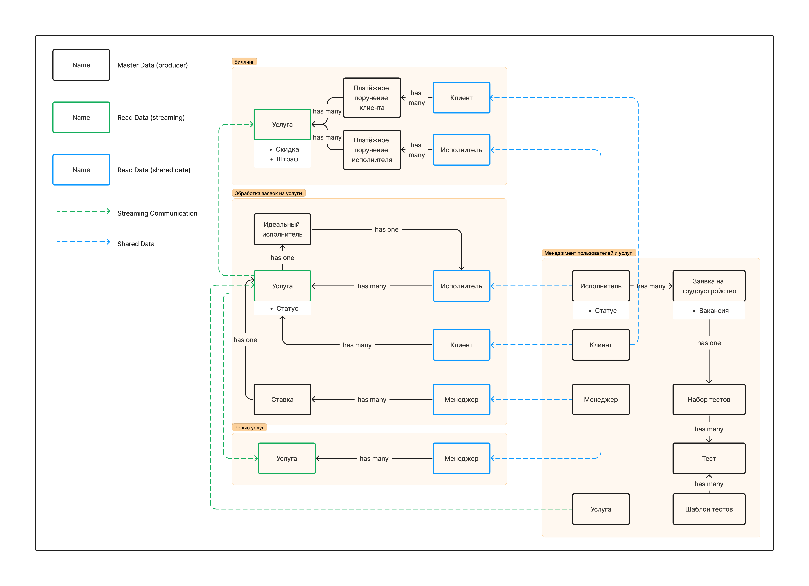

# Модель данных

## Алгоритм действий

1. Вынести контексты из ES-модели.
2. Определить основные модели данных в рамках каждого контекста, выделить атрибуты важные для бизнес-действий.
3. Определить владельцев дублирующихся данных между контекстами, провести связи между контекстами для таких данных.

## Схема модели

