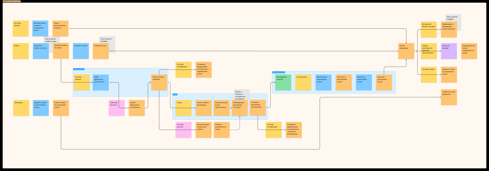
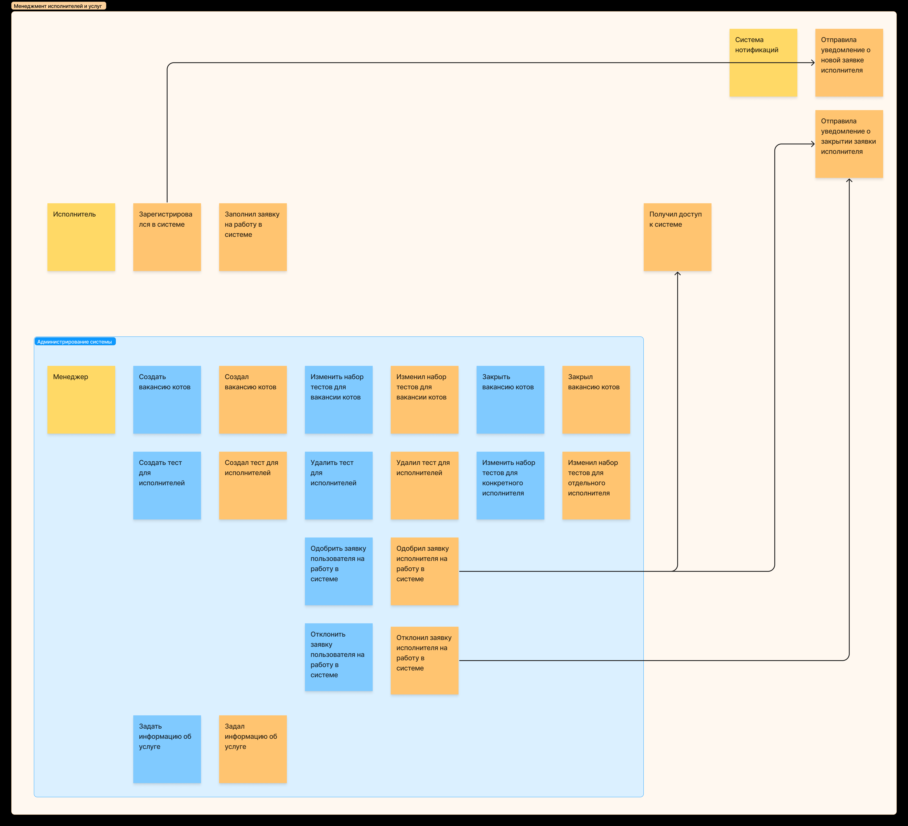
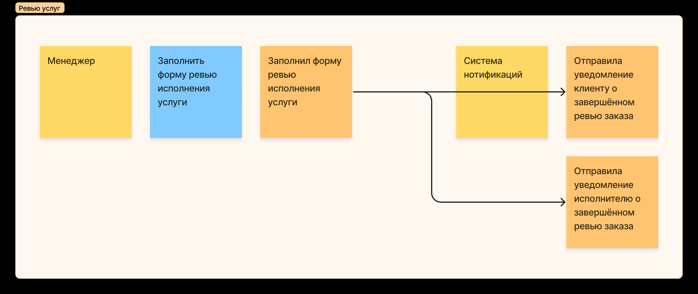
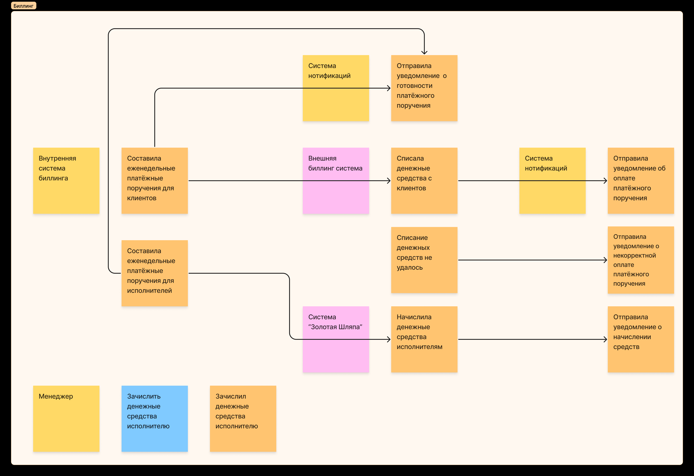

# Event Storming модель системы

## Основные ссылки

* [Шаблон для Miro](https://miro.com/miroverse/event-storming/)
* [Шаблон для Figma](https://www.figma.com/templates/event-storming-example/)

## Алгоритм действий

1. Из требований к системе получить основные события. На этом этапе уже можно добавлять основных акторов и внешние системы.
2. Добавить связи между событиями в виде стрелок (от события инициатора к порождаемому событию).
3. Добавить недостающих акторов, команды и policy.
4. Обозначить контексты (бизнес-доменты), добавить read-model для комплексных моделей.

## Выделенные контексты

[Ссылка на общий Figma-файл](https://www.figma.com/file/xzHeZx3i8ahQCGmH5nzzkn/Event-storming-(week-1)?type=whiteboard&node-id=0%3A1&t=9o139fN6bMMYAc3N-1).

Контексты были определены на основании относительно независимо существующих потоков данных в системе. Так, например, жизненный цикл услуги хоть и влияет на биллинг, но не
привязан к нему непосредственно - даже в случае синхронного обмена сообщения между контекстами детали реализации каждого из них не имеют значения для второго контекста.

### Контекст обработки заявок на услуги

Контекст отвечает за события, происходящие в процессе создания заявки на выполнение услуги и её выполнения. Не включает в себя процесс ревью, так как 
он происходит уже после (не)оказания услуги.

### Контекст менеджмента исполнителей и услуг

Контекст отвечает за администрирование системы. Потенциально, может быть разбит на два подконтекста: контекст менеджмента заявок исполнителей и контекст менеджмента услуг,
но не было найдено весомых причин для разбиения.

### Контекст ревью услуг

Контекст отвечает строго за ревью (не)оказанных услуг. Изолирован от администрирования, может быть выделен в отдельную (внешнюю) подсистему.

### Контекст биллинга

Поскольку биллинг полностью асинхронный и не влияет на жизненный цикл услуги, он может быть изолирован и выделен в отдельный доменный контекст.
