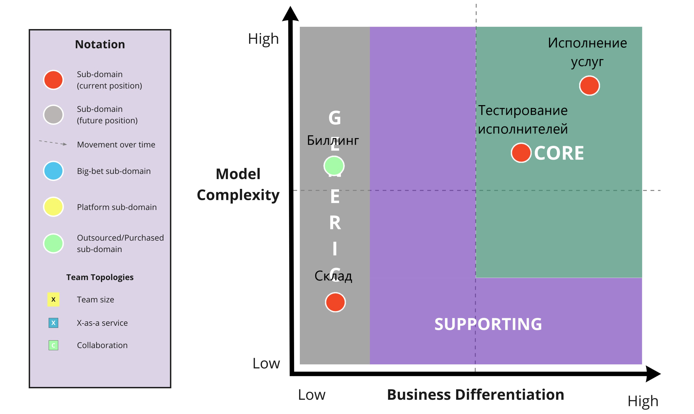
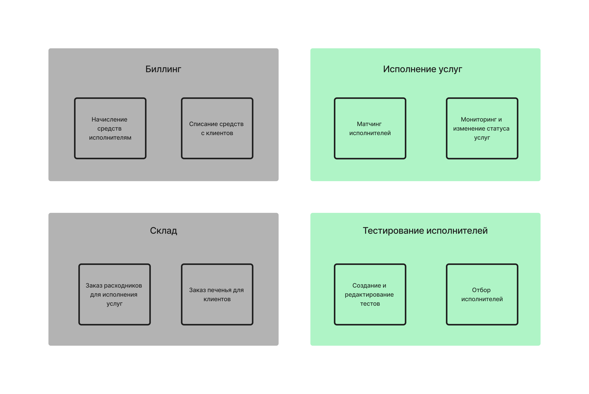
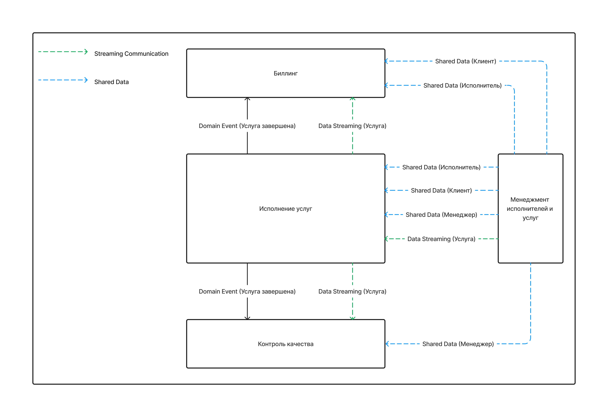

# Доменная модель

В ходе анализа требований к системе и ES-модели, составленной на предыдущей неделе, были выделены следующие поддомены:
- **Исполнение услуг** - включает в себя управление жизненным циклом услуги (выбор пользователем, назначение исполнителя и т.д.) и контроль качества исполнения. 
                         Поддомен определён таким образом, так как отдельные его части не могут существовать сами по себе и сильно связаны с остальными частями домена.
                         Также у поддомена есть свой доменный язык (например, понятие "Эталонный Образец").
- **Cклад** - включает в себя сборку расходников и связь с соответствующими внешними системами ("система печенья").
              Выделен как поддомен, поскольку может быть полностью заменён внешней системой или "чёрным ящиком" в рамках всей системы.
- **Тестирование исполнителей** - включает в себя создание тестов для исполнителей, мониторинг их заявок.
                                  Выделен как отдельный поддомен, так отвечает за важную бизнес-функцию, которая может существовать отдельно, 
                                  даже если исполнение услуг будет отдано на аутсорс.
- **Биллинг** - включает в себя создание платёжных поручений для исполнителей и клиентов.
                Выделен как поддомен, поскольку может быть полностью заменён внешней системой или "чёрным ящиком" в рамках всей системы.
                Также у поддомена есть свой доменный язык (финансовые термины).
                
## Определение типов поддоменов

| Поддомен                  | Конкуретное преимущество | Сложность | Изменчивость |     Тип    |
|---------------------------|:------------------------:|:---------:|:------------:|:----------:|
| Исполнение услуг          |            Да            |  Высокая  |    Высокая   |    Core    |
| Склад                     |            Нет           |   Низкая  |    Низкая    |   Generic  |
| Тестирование исполнителей |            Да            |  Высокая  |    Высокая   |    Core    |
| Биллинг                   |            Нет           |  Высокая  |    Низкая    |   Generic  |

## Выделение bounded contexts

Контексты, выделенные на основании доменной модели

Контексты, выделенные на основание ES-модели первой недели

* Без доменной модели не было чёткого понимания, что "Тестирование исполнителей" должно быть самостоятельным поддоменом с двумя подконтекстами ввиду своей важности для бизнеса.
* Стало очевидно, что "контроль качества" не является отдельным бизнес-контекстом, так как неотделим от "исполнения услуг".
* "Биллинг" остался отдельным поддоменом в обоих случаях.
* Также стало понятно, что "менеджмент исполнителей и услуг" объединяет сущности, принадлежащие к разным доменам. 
  Если последовать модели первой недели, возникла бы ситуация, когда часть одной доменной области (менеджмент услуг) находится в юрисдикции сразу двух менеджеров.
