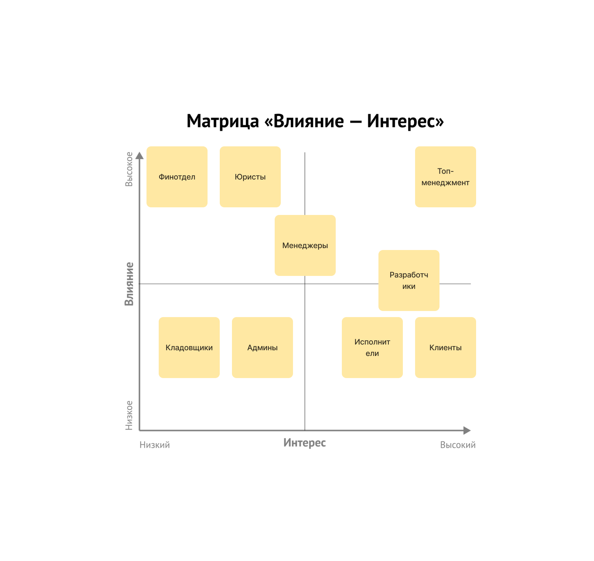
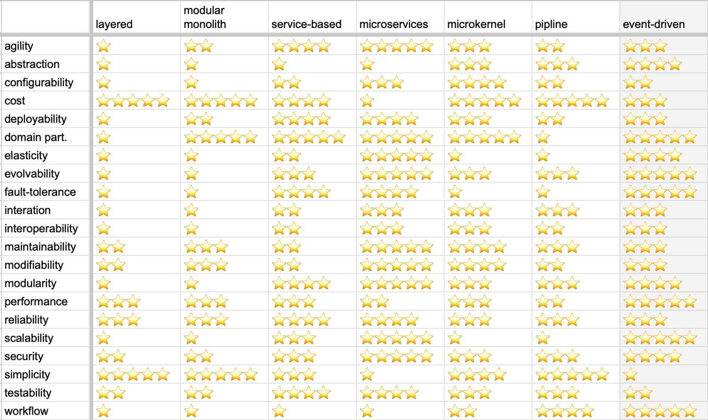

# Проектирование системы, неделя 3.

## Чеклист

[Требования к системе](requirements.md).

- [x] Распишите стейкхолдеров по группам из урока и добавьте пропущенные группы.
- [x] Выберите один из семи архитектурных стилей, описанных в уроке. Опишите, почему вы сделали такой выбор и по каким критериям сравнивали стили.
- [x] Eсли выбрали распределённый архитектурный стиль, опишите, какие сервисы будут отдельно, и объясните, почему каждый из сервисов должен быть отдельно от остальных.
- [ ] Выберите нужный вид баз данных для каждого из полученных сервисов. Если у вас получился один монолит — определите необходимый вид базы для этого монолита. 
      Опишите, почему вы сделали такой выбор и какие критерии использовали для выбора.
- [ ] Выберите нужный стиль коммуникаций и их вид (синхронный/асинхронный). Опишите, почему вы сделали такой выбор и какие критерии использовали для выбора.
- [ ] Предположите, какие фитнес-функции можно использовать для валидации итоговой системы. 
      Можете считать, что система будет делаться с использованием любого языка программирования, следовательно, можете выбрать любые инструменты из любой экосистемы.
- [ ] Сделайте ADR, опишите принятие решения по изоляции одного из элементов как изолированного сервиса.

## Группы стейкхолдеров и их консёрны

### Основные стейкхолдеры

- **Топ-менеджмент**
  - скоринг потенциальных работников уникален в своём роде, и логика его работы сильно выше, чем планировалось. 
    Бизнес в будущем хочет продавать его другим компаниям и тестировать больше гипотез.
  - релизный цикл для всей системы — месяц, для скоринга работников — неделя максимум.
- **Менеджеры**
  - хотят, чтобы о системе ставок не знали другие отделы, иначе будет некрасивая ситуация. Они хотят скрыть эту систему даже от разработчиков, которые не будут ей заниматься, и от начальства;
  - выяснилось, что котам из Happy Cat Box наш проект понравился, поэтому приходит не 10 заказов в день, а 10 заказов в минуту.
- **Финотдел**
  - списывать деньги с клиентов каждую неделю слишком затратно для отдела, поэтому они хотят списывать деньги раз в месяц, но платить воркерам и дальше раз в неделю. При этом необходимо постоянно добавлять новые способы списания денег для клиентов. Воркеры всегда работают через компанию «Золотая шляпа»;
  - боятся потерять любую финансовую информацию и хотят решение, которое будет гарантировать, что всё будет ок.
- **Разработчики**
  - система должна работать без сбоев, а если сбой случается, то должно быть понятно, что и где чинить.
- **Админы**
  - простота мониторинга системы для своевременного замечания сбоев, чтобы не работать в авральном режиме.
- **Юристы**
  - соответствие всей системы правовым нормам.
- **Клиенты**
  - ожидаемое поведение системы: без сбоев и тупняков.

### Фантазии на тему стейколдеров
- **Исполнители**
  - простой процесс подачи заявки на работу с оповещениями о результате.
  - usability фичи в приложении (поиск клиента, выполнение заявки).
- **Кладовщики**
  - отсутствие потерь заявок на сборку расходников (боятся, что будут спрашивать с них).

### Матрица стейкхолдеров

## Архитектурный стиль системы

### Характеристики, важные для системы

- **Reliability**: исполнение услуг, финансовые сервисы ([US-030]); вся система (консёрны разработчиков).
- **Modifiability**: исполнение услуг - матчинг ([US-070]); найм и менеджмент исполнителей ([US-100]).
- **Elasticity**: найм и менеджмент исполнителей ([US-080]).
- **Consistency**: финансовые сервисы (общий compliance, [US-240], [US-250]).
- **Simplicity**: сервис ставок ([US-270], [US-271]).
- **Deployability**: вся система, особенно - матчинг и отсев исполнителей (требования к ТТМ, консёрны топ-менеджмента).
- **Scalability**: исполнение услуг (консёрны менеджмента).
- **Maintainability**: вся система (консёрны админов).

### Выбор архитектурного стиля

- Исходя из того, что стоимость реализация системы не принципиальна, нет необходимости выбирать определённые стили для удешевления стоимости.
- Для многих частей системы (матчинг; отсев исполнителей) важна характеристика deployability, что означает, что эти части нужно выделить в отдельные сервисы.
- Так как scalability важна для системы исполнения услуг, имеет смысл также выделить сервис менеджмента статуса заявок как отдельный сервис в системе.
- Исходя из важности финансовых данных, имеет смысл публиковать связанные с финансами данные в виде сообщений, чтобы данные сохранялись для обработке даже в случае аварий в сервисах системы.
- Поскольку найм и менеджмент исполнителей может подвергаться DDOS-атакам со стороны конкурентов, его тоже стоит выделить как отдельный сервис.
- Биллинг исполнителей и клиентов имеет смысл отделить друг от друга, так как они реагируют на разные сообщения и могут эволюционировать по-разному, даже если логика изначально похожа.

Таким образом, общий архитектурный стиль системы определён как event-driven.

### Сервисы системы

(извините, тут должна быть красивая схема, но я не успел)

- **Матчинг исполнителей** - пайплайн матчинга исполнителей для заявок клиентов.
- **Менеджмент статуса заявок** - API для мобильного приложения исполнителей и веб-приложения клиентов, создание заявок и изменение их статуса. 
  Поскольку клиентов пока мало, включает в себя ещё и работу с клиентами как пользователями системы.
- **Склад** - отвечает за менеджмент статуса расходников для заявки, отправку запроса на печенье во внешнюю систему.
- **Биллинг исполнителей** - сервис для расчёта платёжных поручений исполнителей.
- **Биллинг клиентов** - сервис для расчёта платёжных поручений клиентов.
- **Сервис ставок для менеджеров** - [ДАННЫЕ УДАЛЕНЫ].
- **Найм и менеджмент исполнителей** - конфигурация тестов для исполнителей, одобрение заявок.
