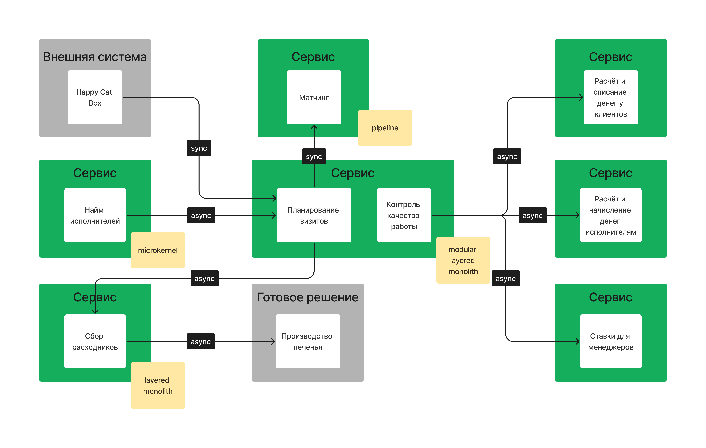

# Проектирование системы, неделя 4.

## Чеклист

[Требования к системе](requirements.md).

В этом уроке нам необходимо исправить систему, которую сделали до нас? то есть надо из «начальной системы» получить то, что получилось в конце третьей недели.

- [х] Для каждого сервиса, который добавится или удалится, и связанных с ним сервисов посчитайте значение instability.
- [x] Опишите, какие сервисы и боундед-контексты в каком месте и каким образом будут меняться.
- [x] Спланируйте, как и в какой последовательности будет происходить работа. Можете выбрать одно из двух условий: нет людей, нет ресурсов.

## Архитектура начальной системы

[Архитектурное описание](../week-0/architecture.md).

**Недостатки:**
- В начальной схеме сервисы определены по техническим шагам, нет привязки к требованиям.
- Не учтено, что биллинг может быть раздельным для исполнителей и заказчиков.
- Нет полного контекста принятия решений.
- Не учтена Happy Cat Box как внешняя система.

**Плюсы:**
- Система спроектирована за 1 вечер.
- Дан глоссарий терминов системы.
- Какой-то контекст принятий решений описан.

## Целевая система

В качестве допущения представим, что компания MCF наняла архитектора А., который за 4 недели спроектировал идеальный вариант системы и ушёл в годовой отпуск, оставив
миграцию уже имеющейся команде. Схема данной системы приведена на изображении ниже.

### Необходимые изменения

В новой системе определены следующей bounded context:
- Менеджмент заказов
- Увеличение лояльности клиентов
- Увеличение мотивации менеджеров
- Улучшение скорости обслуживания
- Найм исполнителей
- Подбор исполнителей под задачу

Тогда в имеющейся системе имеются следующие соответствия:

1. Betting Service → Домен "увеличение мотивации менеджеров", функционал "ставки для менеджеров".
2. Workers Matching Pipeline → Домен "подбор персонала под задачу", функционал "матчинг".
3. Bill Statements Service → Домен "менеджмент заказов", функционал "расчёт и списание денег у клиентов" и "расчёт и начисление денег исполнителям".
4. Workers Exchange Service → Домен "менеджмент заказов", функционал "планирование визитов".
5. User Management Service → Система Happy Cat Box.
6. Workers Management Service → Домен "найм исполнителей", функционал "найм исполнителей".
7. Inventory Management Service → Домен "Улучшение скорости обслуживания", функционал "сбор расходников" и "сборка печенья".

Не имеют соответствия сервисы:
1. Billing Service → 💥 
2. Notifications Service → 💥
3. System Management Service → 💥

В исходной системе отсутствует функционал:
1. Улучшение качества обслуживания.

Таким образом, необходимо произвести следующие изменения (приведены в необходимом порядке):
1. Удалить System Management Service.
2. Добавить функционал "улучшение качества обслуживания" в сервис с планированием визитов.
3. Добавить интеграцию с внешней системой готовки печенья.
4. Вынести механизм нотификаций из сервиса в каждый сервис по отдельности.
5. Перевести Betting Service на чтение данных о заказах из очереди.
6. Удалить синхронные коммуникации к и от Betting Service.
7. Добавить публикацию сообщений о исполнении заказов в сервис менеджмента заказов.
8. Перевести Bill Statements Service на чтение данных о заказах из очереди.
9. Удалить синхронные коммуникации с Billing Service.
10. Удалить Billing Service.
11. Вынести функционал "расчёт и начисление денег исполнителям" и "расчёт и списание денег у клиентов" в два отдельных сервиса.

Пункты 5 и 9 требуют особого внимания, так как меняется модель коммуникаций между сервисами и модель данных - необходимо использовать Change Data Capture.

Так как для рефакторинга системы пришлось нанимать архитектора А., будем считать, что на рефакторинг системы есть ресурсы, но не хватает людей/знаний.
Тогда в первую очередь имеет смысл начать с low effort/high value изменений: добавления отсутствующего функционала, перенесение имеющейся логики без изменений, удаление ненужного сервиса.
После этого можно начать работу с некритичным для системы сервисом ставок, опробовав на нём механизм CDC. 
Затем можно переходить к самому чувствительному мест в системе - работе с финансами. 
Разнесение расчётов для исполнителей и клиентов можно оставить напоследок, так как это изменение несёт меньше всего преимуществ и больше всего рисков в краткосрочной перспективе.

### Изменения нестабильности

1. Betting Service: 1 входящая коммуникация, 2 исходящих коммуникации (нестабильность: 2/(2+1) = 0.66) → 1 входящая коммуникация (нестабильность 0/(0+1) = 0).
2. Workers Matching Pipeline: 1 входящая коммуникация, 1 исходящая коммуникация (нестабильность 1/(1+1) = 0.5) → без изменений.
3. Bill Statements Service: 1 сервис, 1 исходящая коммуникация (нестабильность 1/(1+0) = 1) → 2 сервиса, 1 входящая коммуникация каждый (нестабильность 0/(0+1) = 0).
4. Workers Exchange Service: 3 входящих коммуникации, 3 исходящих коммуникации (нестабильность 3/(3+3) = 0.5) → 2 входящих коммуникации, 4 исходящих коммуникации (нестабильность 4/(4+2) = 0.66).
5. User Management Service: 3 входящих коммуникации (нестабильность 0/(0+3) = 0) → 💥.
6. Workers Management Service: 3 входящих коммуникации, 2 исходящих коммуникации (нестабильность 2/(2+3) = 0.4) → 1 исходящая коммуникация (нестабильность 1/(1+0) = 1).
7. Inventory Management Service: 1 входящая коммуникация (нестабильность 0/(0+1) = 0) → 1 входящая коммуникация, 1 исходящая коммуникация (нестабильность 1/(1+2) = 0.5).
8. Billing Service: 3 входящих коммуникации (нестабильность 0/(0+3) = 0) → 💥 
9. System Management Service: 4 исходящих коммуникации (нестабильность 4/(0+4) = 1) → 💥

**Средняя нестабильность в системе**: 0.45 → 0.44

Нестабильность не увеличилась, количество связей и сервисов в системе уменьшилось многократно.

